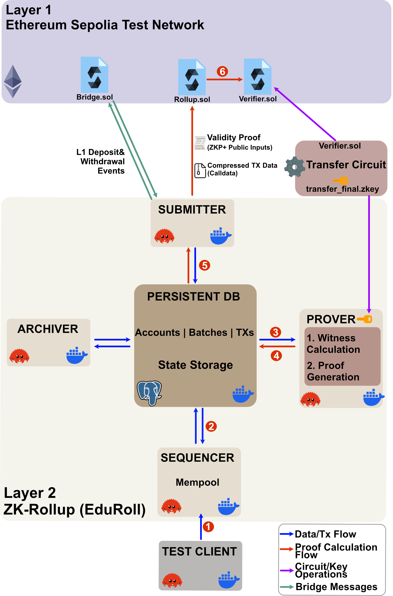

 # EduRoll
EduRoll: End-to-End Ethereum zk-Rollup (L1 Contracts, Sequencer, Circuits) Built From Scratch

**EduRoll** is an end-to-end zk-rollup prototype built entirely from scratch, including:
- L1 smart contracts (`Rollup.sol`, `Bridge.sol`, `Verifier.sol`)
- L2 sequencer, prover, submitter, and archiver (Rust + Docker)
- ZK circuit (Groth16, Circom/Noir)
- PostgreSQL data layer
- Full Dockerised microservice environment

EduRoll demonstrates the architecture of modern zk-rollups deployed on Ethereum:
state execution → batching → proving → L1 verification → state finalisation.

---

## 📚 System Architecture (High-Level)


<a href="./docs/assets/diagrams/SystemOverview.png">
  
</a>

---

## System Components (Overview)

See **[`/docs`](./docs/README.md)** for the full explanation.

### **Layer 1 (Ethereum)**  
- **`Rollup.sol`** — Stores canonical L2 state root and validates batch proofs  
- **`Verifier.sol`** — Auto-generated zkSNARK verifier contract  
- **`Bridge.sol`** — Handles deposits and withdrawals between L1 ↔ L2 


### **Layer 2 (Off-Chain Services)**  
- **Sequencer** — Validates, orders, and executes L2 transactions; creates batches  
- **Prover** — Generates Groth16 proofs for each batch  (A batch is accepted to consist of 100 transactions)
- **Submitter** — Submits proven batches to `Rollup.sol`  
- **Archiver** — Indexes txs and batches for external queries  
- **Persistent DB (PostgreSQL)** — Central coordination layer for all off-chain components  


### **Client**
- **Test Client** — Generates signed L2 transactions and sends them to the Sequencer RPC

---

## Running the Project
**Note:** A Makefile will be added once the L1 and L2 development is complete.  
During development, you can use the commands below to run the environment.

Full setup instructions (Docker, Rust services, circuits, keys, and L1 deployment)  
will be added as the implementation progresses.

#### Standard Docker
```bash
    docker-compose up --build -d
```
#### Using Colima (Lightweight Docker Alternative)
If you have [colima](https://github.com/abiosoft/colima),  a lightweight Docker alternative suitable for low-resource systems, start it first:

```bash
    colima start
```

OR to further limit CPU and memory usage (optional) :
```bash
    colima start --cpu 6 --memory 10 --runtime docker
```

Then run the project:

```bash
    COMPOSE_PARALLEL_LIMIT=1 docker-compose up --build -d
```
#### Checking the system


```bash
  docker-compose logs sequencer prover submitter
```

Expected output:

```bash
  Submitter is here!
```

---

## Performance & Scalability Analysis
The performance of a ZK-Rollup is defined by the trade-off between **Prover Latency** (proof generation time) and **Amortised L1 Gas Costs** (cost per transaction on Ethereum). Detailed architectural reasoning and academic justifications are provided in the [Full Documentation](./docs/README.md).

`Batch Size Strategy`
EduRoll is configured with a default batch size of 100 transactions.

**L2 Prover Latency:** A batch size of 100 allows for proof generation without excessive memory overhead.

**L1 Amortisation:** While larger batches increase prover time, they significantly reduce the cost per user.

## Benchmarks (Evaluation in Progress)
The following table provides the technical performance metrics for the EduRoll system. These benchmarks are conducted on a local environment to simulate the performance of the Prover and the L1 Verifier.

| Metric | EduRoll (Batch=100) | Metric Description |
|---|---|---|
| Circuit Constraints | TBA | Total R1CS constraints for the `transfer` circuit logic. |
| Witness Generation | TBA | Time to calculate the witness for a batch. |
| Proof Generation Time | TBA | Total time for the `Prover` to generate a Groth16 ZK-SNARK. |
| Verification Gas Cost | TBA | The cost of running the `verifyProof()` function on L1. |
| Finality (Soft) | TBA | The time for the `Sequencer` to acknowledge and store the batch. |
| Finality (Hard) | TBA | Time until the proof is verified and the batch is finalised on-chain (Ethereum). |
