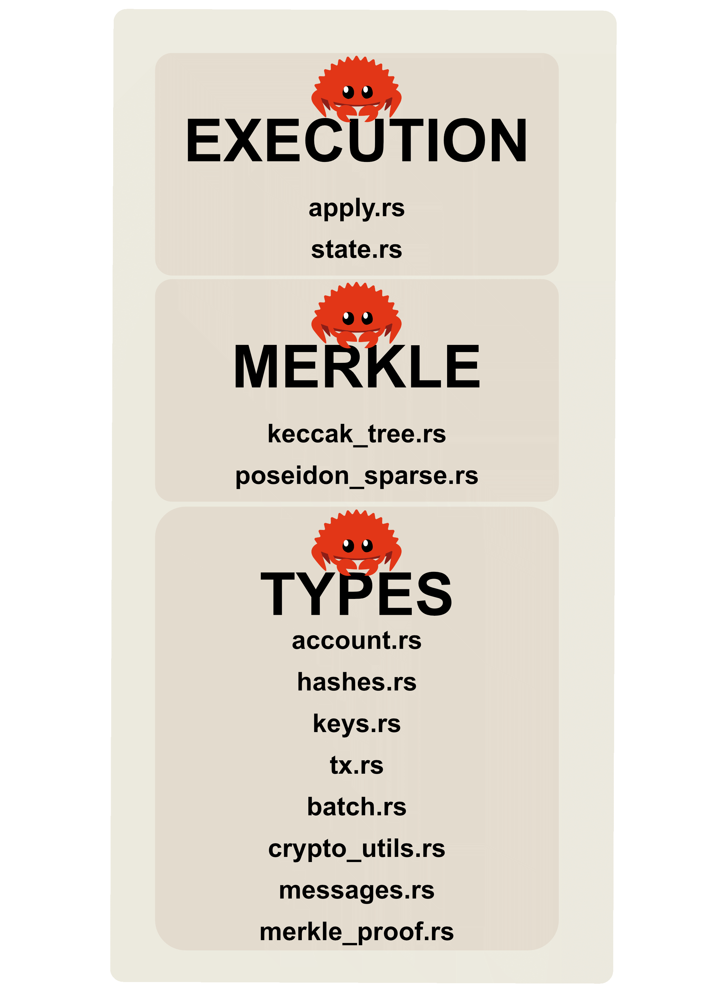

# Off-Chain Rust Crates (Core Logic)

The off-chain logic is a Rust workspace of modular crates, with concerns separated and the crates shared across the services (sequencer, prover, submitter, archiver).

The `types`, `merkle`, and `execution` crates are the shared foundation: the service containers (sequencer, prover, submitter, archiver) build on these library crates rather than re-implementing the logic. Their per-crate usage is detailed below.

## `offchain/crates/types`
The shared data structures used across the whole system.

- **`tx.rs`:** the `L2Transaction` struct (sender, recipient, amount, nonce, EdDSA signature).
- **`account.rs`:** the `AccountState` struct (L2 address, pubkey, balance, nonce, leaf index).
- **`batch.rs`:** the `Batch` and proof structs.
- **`crypto_utils.rs`:** circomlib-compatible Poseidon hash helpers.
- **`hashes.rs`:** the `KeccakHash` and `PoseidonHash` 32-byte wrapper types.
- **`keys.rs`:** BabyJubJub key types.
- **`merkle_proof.rs`:** Merkle proof types.
- **`messages.rs`:** API request/response structs for the sequencer's RPC.
- **`lib.rs`:** re-exports the modules.

## `offchain/crates/merkle`
Manages the L2 state tree: updates account leaves and computes the root.

Used by the **sequencer** (to compute the new state root after a batch) and the **prover** (to build the Merkle witness for the circuit).

- **`poseidon_sparse.rs`:** the L2 state tree - a **fixed-depth (depth 20) Poseidon Merkle tree** with precomputed empty-subtree defaults, keyed by a sequential `leaf_index`. Poseidon keeps in-circuit hashing cheap (a few hundred constraints per hash, versus tens of thousands for Keccak), so the prover is fast and low-RAM. (It is not a true address-keyed sparse Merkle tree - that is future work.)
- **`keccak_tree.rs`:** a Keccak-256 Merkle tree over the batch's transactions, reserved for an Ethereum-native (L1) commitment (not currently wired - the live L1 commitment is a flat `keccak256(batchData)` in the submitter).

## `offchain/crates/execution`
The deterministic State Transition Function (STF): it applies a batch of transactions to the tree to produce a new state root.

Used by the **sequencer** to advance the canonical state. The **prover** rebuilds the same transition independently inside its witness builder (`build_witness_from_db`), rather than calling this crate.

- **`apply.rs`:** transaction validation and application (nonce check, balance check, debit/credit, leaf updates).
- **`state.rs`:** the in-memory L2 world state, wrapping the Merkle tree.

## `offchain/crates/storage`
SQL queries grouped by service, run against the PostgreSQL coordination hub - inserting transactions, closing batches, writing the pre-batch snapshot, fetching a batch's txs + snapshot for the prover, and advancing batch status (`PENDING_PROOF -> PROVEN -> SUBMITTED_TO_L1 -> FINALIZED`).